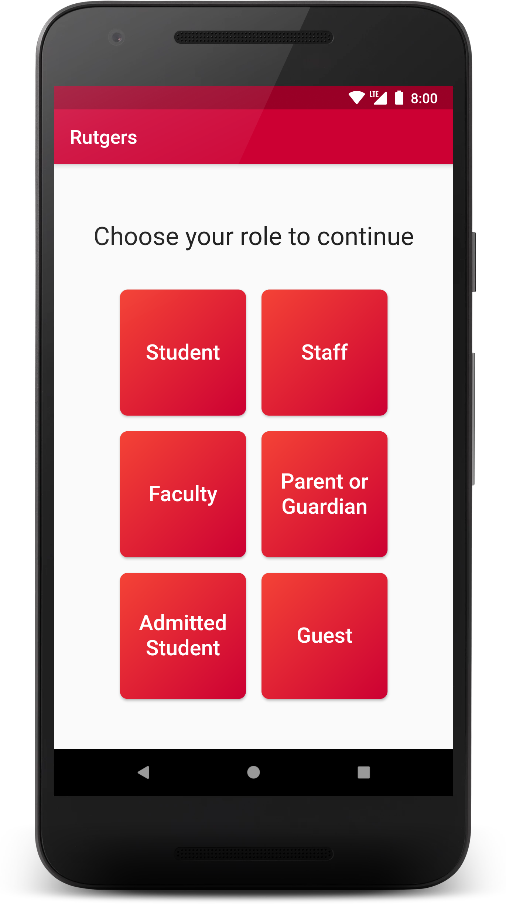
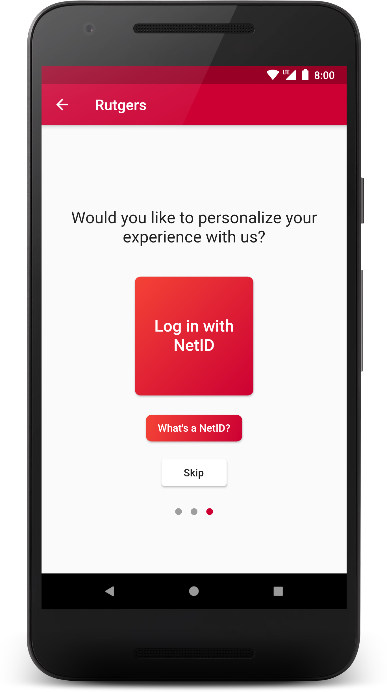
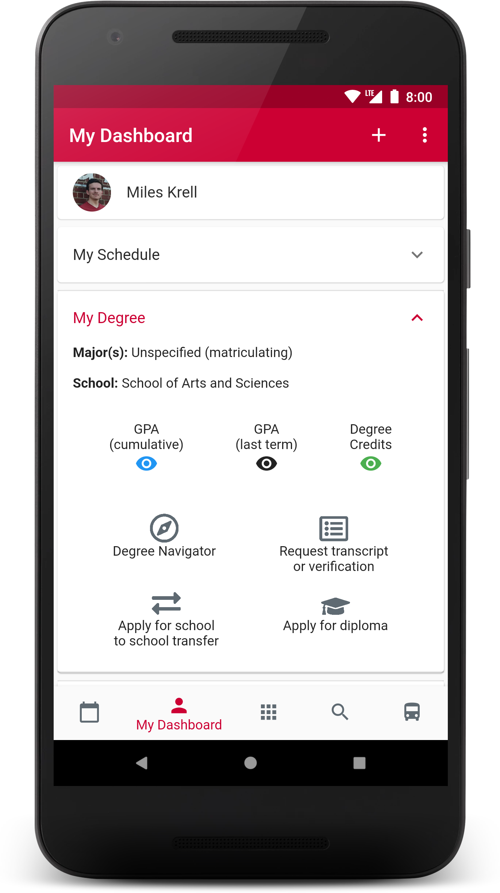
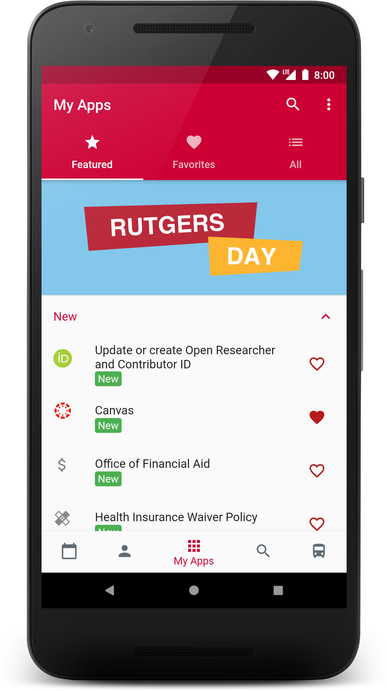
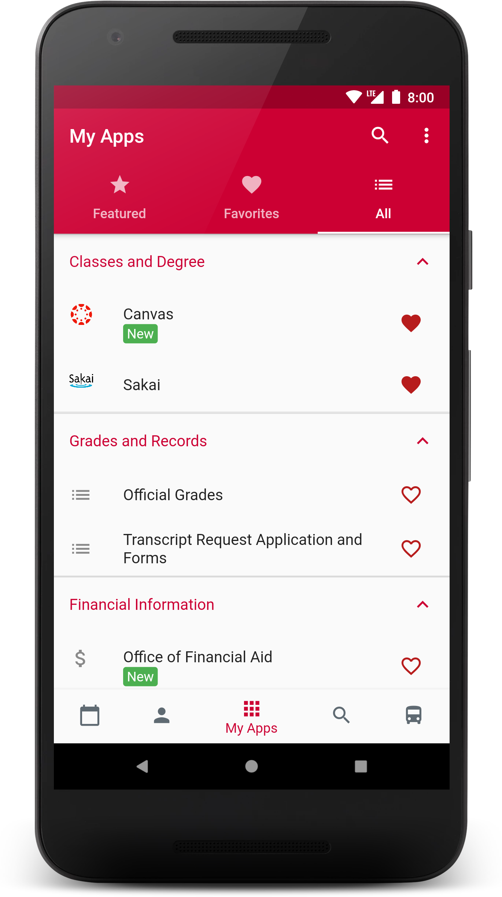

# Rutgers Flutter Mock

This repository contains my initial Flutter mockup for the cross-platform Rutgers app rewrite.

The basic design of the UI has now been finalized, so work in this repo is done. 

This repo reflects many components of the team's chosen design as it was at the end of August 2019.

# Screenshots

| Role Selection | Onboarding | My Dashboard |
| - | - | - |
|  |  |  |

| My Apps: Featured | My Apps: All |
| - | - |
|  |  |
